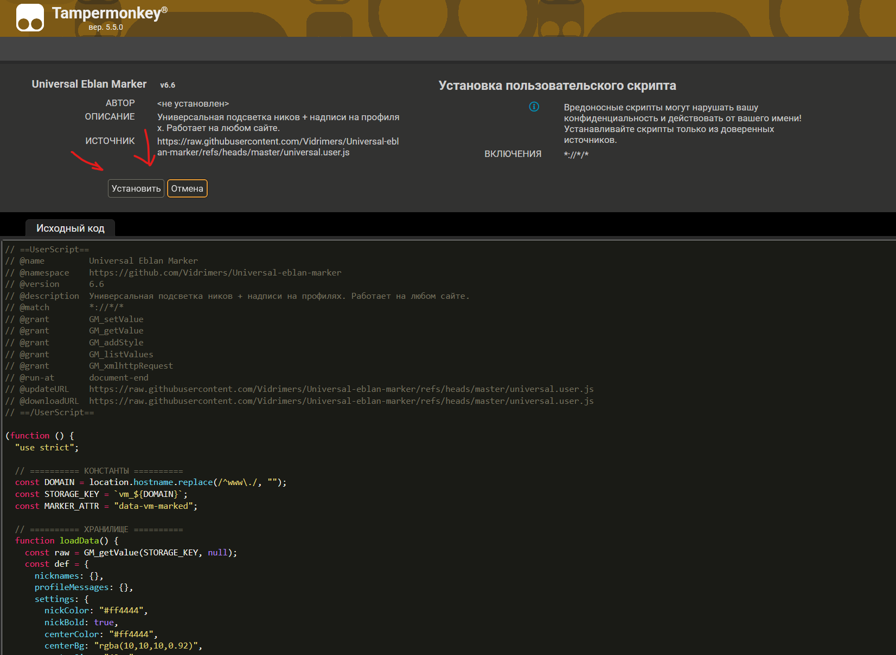
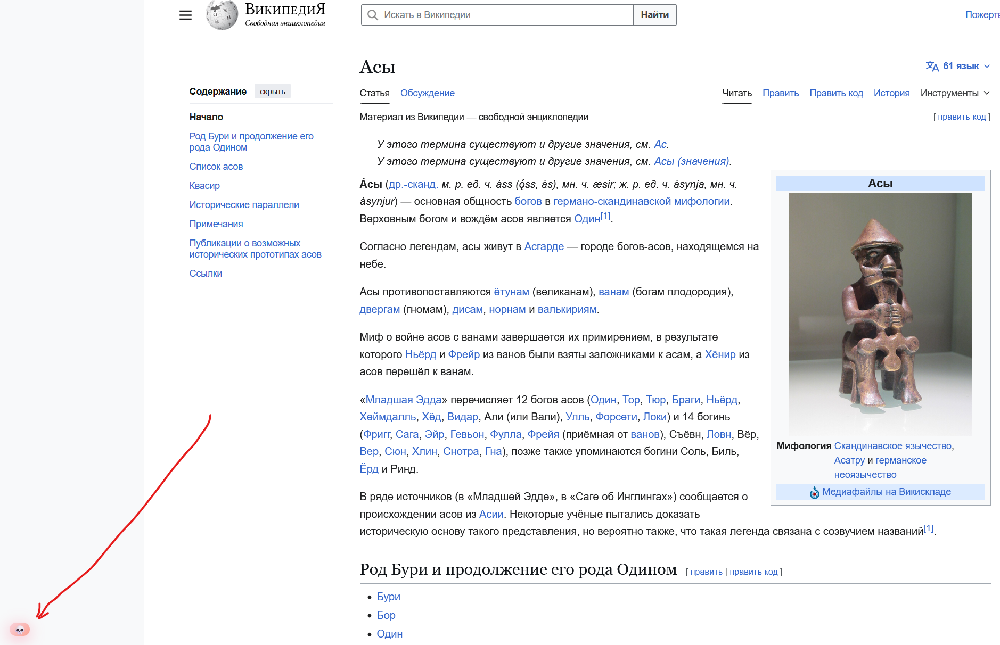
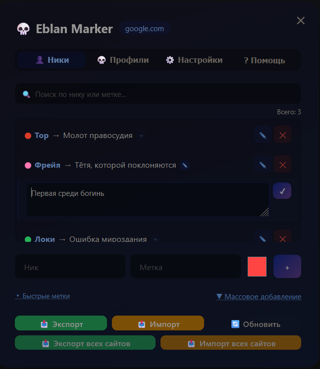

# 💀 Universal Eblan Marker

Userscript для Tampermonkey — подсвечивает ники и оставляет надписи в профилях на любом сайте. Незаменим на форумах, маркетплейсах и в любых сообществах где нужно помнить кто есть кто.

> Версия: 6.6 | Работает на любом сайте (`*://*/*`)

---

## 📋 Содержание

- [Установка](#установка)
- [Функции](#функции)
  - [Подсветка ников](#подсветка-ников)
  - [Надписи в профилях](#надписи-в-профилях)
  - [Быстрые метки](#быстрые-метки)
  - [Массовое добавление](#массовое-добавление)
  - [Поиск](#поиск)
  - [Заметки](#заметки)
  - [Настройки](#настройки)
  - [Экспорт и импорт](#экспорт-и-импорт)
  - [Обновления](#обновления)
- [Хранение данных](#хранение-данных)

---

## Установка

**Шаг 1.** Установи расширение Tampermonkey для своего браузера:

- [Chrome / Edge / Opera](https://www.tampermonkey.net/)
- [Firefox](https://www.tampermonkey.net/?browser=firefox)

**Шаг 2.** Нажми кнопку ниже чтобы установить скрипт:

[](https://raw.githubusercontent.com/Vidrimers/Universal-eblan-marker/refs/heads/master/universal.user.js)

> При открытии ссылки Tampermonkey автоматически распознает скрипт и откроет диалог установки. Нажми **«Установить»**.



---

## Функции

После установки на любой странице появится маленькая кнопка 💀 в левом нижнем углу. Нажми на неё чтобы открыть панель управления.





---

### Подсветка ников

Вкладка **👤 Ники** — добавь ник пользователя и метку. Скрипт найдёт все упоминания этого ника на странице и подпишет метку рядом цветным текстом.

**Пример:**

```
beex → скаммер
```

Результат на странице: `beex` **(скаммер)**

Для каждого ника можно выбрать **индивидуальный цвет** метки — например красный для токсиков, зелёный для проверенных людей. Цвет по умолчанию берётся из настроек.

<!-- СКРИНШОТ: img/nicks_tab.png — вкладка «Ники» со списком добавленных ников и цветными точками -->

<!-- СКРИНШОТ: img/nick_highlight.png — пример подсветки ника прямо на форуме -->

---

### Надписи в профилях

Вкладка **💀 Профили** — при заходе на страницу профиля конкретного пользователя по центру экрана появится большая надпись.

Нужно указать **ID пользователя** (числовой) и текст надписи. Скрипт автоматически определяет ID из URL по настроенным паттернам.

**Пример:** при открытии `/seller/beex/1179730` появится надпись **СКАММЕР**.

<!-- СКРИНШОТ: img/profiles_tab.png — вкладка «Профили» со списком -->

<!-- СКРИНШОТ: img/center_message.png — большая надпись по центру экрана на странице профиля -->

---

### Быстрые метки

Кнопка **▾ Быстрые метки** под строкой добавления — показывает список всех уникальных меток которые ты уже использовал. Кликни на метку чтобы мгновенно вставить её в поле вместе с цветом — не нужно каждый раз печатать одно и то же.

<!-- СКРИНШОТ: img/presets.png — открытый список быстрых меток с цветными точками -->

---

### Массовое добавление

Кнопка **▼ Массовое добавление** — позволяет добавить до 100 ников за раз. Вставь список ников по одному на строку, укажи общую метку и цвет.

<!-- СКРИНШОТ: img/bulk_add.png — раскрытая секция массового добавления с textarea и счётчиком строк -->

---

### Поиск

В каждой вкладке есть строка поиска — фильтрует список мгновенно при вводе. Поиск работает по нику, метке и тексту заметки одновременно. Показывает счётчик найденных записей.

<!-- СКРИНШОТ: img/search.png — поиск с результатами и счётчиком «Найдено: X из Y» -->

---

### Заметки

У каждого ника есть кнопка заметки:

- **+** (полупрозрачная) — заметки нет, нажми чтобы добавить
- **✎** (синяя) — заметка есть, нажми чтобы просмотреть или изменить

Заметка разворачивается прямо под строкой ника — не занимает лишнего места, если не нужна.

<!-- СКРИНШОТ: img/note_closed.png — список ников, у одного синяя кнопка ✎ -->

<!-- СКРИНШОТ: img/note_open.png — раскрытая заметка с textarea и кнопкой сохранить -->

---

### Настройки

Вкладка **⚙️ Настройки**:

| Параметр              | Описание                                    |
| --------------------- | ------------------------------------------- |
| Цвет метки ника       | Цвет по умолчанию для новых ников           |
| Цвет надписи (центр)  | Цвет текста большой надписи на профиле      |
| Цвет рамки            | Цвет рамки большой надписи                  |
| Размер шрифта (центр) | Размер текста надписи, например `42px`      |
| Показывать всегда     | Надпись на профиле не исчезает сама         |
| Паттерны URL для ID   | Regex для извлечения ID пользователя из URL |

**Паттерны URL** — если сайт использует нестандартный формат ссылок на профиль, добавь свой паттерн. По умолчанию поддерживаются форматы `/profile/123`, `/member/123`, `?u=123`.

Пример для plati.market: `/seller/[^/]+/(\d+)`

<!-- СКРИНШОТ: img/settings.png — вкладка настроек -->

---

### Экспорт и импорт

Данные хранятся отдельно для каждого сайта. Кнопки в нижней части панели:

| Кнопка                 | Действие                                     |
| ---------------------- | -------------------------------------------- |
| 📥 Экспорт             | Скачать данные текущего сайта в JSON         |
| 📤 Импорт              | Загрузить данные для текущего сайта из JSON  |
| 📥 Экспорт всех сайтов | Скачать данные всех сайтов одним файлом      |
| 📤 Импорт всех сайтов  | Загрузить данные для всех сайтов из файла    |
| 🔄 Обновить            | Перезагрузить страницу (применить изменения) |

---

### Обновления

При открытии панели скрипт тихо проверяет наличие новой версии на GitHub (не чаще раза в сутки). Если обновление доступно — появится зелёная плашка:

```
🆕 Доступно обновление: v6.6 → v6.7   [⬆️ Установить]
```

Нажми **«Установить»** — Tampermonkey откроет диалог обновления.

<!-- СКРИНШОТ: img/update_banner.png — зелёная плашка об обновлении над вкладками -->

---

## Хранение данных

Данные сохраняются в хранилище Tampermonkey (`GM_storage`) — они **не пропадут** при очистке куков и кеша браузера. Каждый сайт хранит свои данные отдельно.

Структура JSON при экспорте:

```json
{
  "nicknames": {
    "username": {
      "label": "токсик",
      "color": "#ff4444",
      "note": "грубит в каждом треде"
    }
  },
  "profileMessages": {
    "123456": "СКАММЕР"
  },
  "settings": { ... }
}
```
